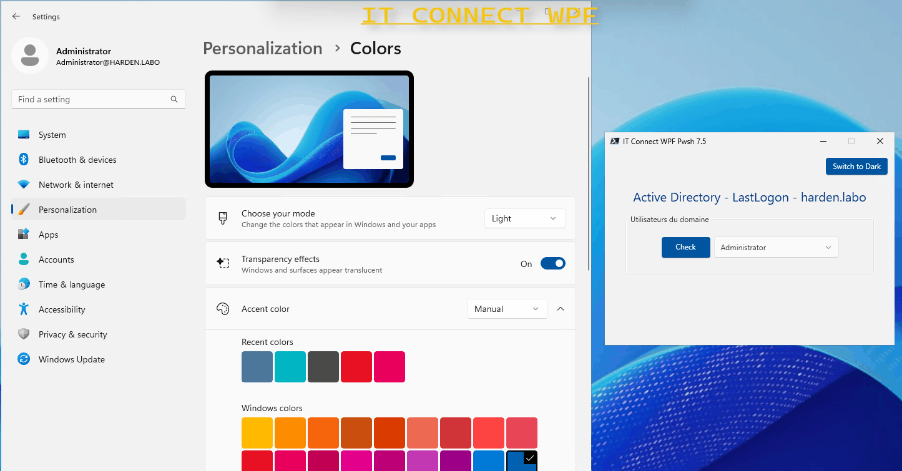

# Créer une interface graphique avec PowerShell 7.X (PowerShell Core) et WPF

## Vue d'ensemble

Les fichiers disponibles dans cet espace GitHub correspondent aux fichiers sources utilisés dans le cadre du tutoriel disponible sur IT-Connect. Ces fichiers accompagnent les explications fournies dans le tutoriel "**PowerShell 7.X : comment créer une interface graphique WPF avec le style Windows 11 ?**" disponible sur **www.it-connect.fr**.

- Merci à l'auteur : **Jérôme BEZET-TORRES**

## Ressources

- Lien vers l'article : [PowerShell 7.X : comment créer une interface graphique WPF avec le style Windows 11 ?](https://www.it-connect.fr/powershell-7-x-comment-creer-une-interface-graphique-wpf-avec-le-style-windows-11/)

